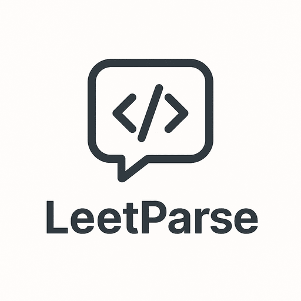

# LeetParse - Chrome Extension



A powerful Chrome extension built with Vite and React that helps competitive programmers parse LeetCode problems and generate ready-to-use boilerplate code with test cases.

## 📝 Description

LeetCode Parser is a developer-oriented Chrome extension that streamlines the process of solving LeetCode problems in your own development environment. It automatically extracts problem details, generates boilerplate code with proper input/output handling, and formats test cases for easy testing.

## ✨ Features

- **One-Click Problem Parsing**: Extract all necessary information from LeetCode problem pages with a single click
- **Automatic C++ Template Generation**: Generate complete, compilable C++ code with:
  - Solution function signature automatically extracted from the problem
  - Standard input/output handling code included
  - Support for standard C++ data structures (vectors, maps, strings, etc.)
  - Support for LeetCode special data structures (ListNode, TreeNode)
- **Theme Support**: Choose between:
  - Light mode
  - Dark mode
  - System preference
- **Auto-Parse Option**: Automatically parse problems when loading the page
- **Complex Data Structure Support**: Automatically handle:
  - Linked Lists
  - Binary Trees
  - Nested vectors/arrays
  - Strings and characters
  - Integer types of various sizes
- **Test Case Extraction**: Automatically extract sample test cases from the problem statement
- **Clipboard Integration**: Copy generated code and test cases with one click
- **Instant Feedback**: Clear status indicators and error messages
- **Lightweight**: Minimal impact on browser performance
- **Works Offline**: Once loaded, can generate code without an internet connection

## 🚀 Installation

### From Source

1. Clone the repository:
   ```bash
   git clone https://github.com/yourusername/leetcode-parser.git
   cd leetcode-parser
   ```

2. Install dependencies:
   ```bash
   npm install
   ```

3. Build the extension:
   ```bash
   npm run build
   ```

4. Load the extension in Chrome:
   - Open Chrome and go to `chrome://extensions/`
   - Enable "Developer mode" in the top-right corner
   - Click "Load unpacked" and select the `dist` folder created by the build
   - The extension icon should appear in your browser toolbar

## 📋 Usage

1. Navigate to any LeetCode problem page (e.g., https://leetcode.com/problems/two-sum/)
2. Click the LeetCode Parser extension icon in your Chrome toolbar
3. Click the "Parse Problem" button in the popup
4. Wait for the extension to parse the problem and generate code (usually instantaneous)
5. Use the "Copy Input" button to copy the test cases
6. Use the "Copy Code" button to copy the generated C++ boilerplate code
7. Paste into your preferred C++ environment (VSCode, CLion, etc.)
8. Focus on implementing your solution algorithm instead of setting up boilerplate code

## 🔍 How It Works

1. **Content Script**: When you click "Parse Problem", the extension:
   - Injects a content script into the LeetCode page
   - Extracts problem details from the DOM
   - Identifies the solution function signature, parameter types, and expected return type
   - Collects sample test cases

2. **Background Script**: The extension background script:
   - Processes the extracted data
   - Determines the appropriate C++ types for LeetCode's data structures
   - Generates proper input parsing code for each parameter type
   - Creates complete C++ boilerplate code

3. **Popup UI**: The extension popup:
   - Provides a clean interface to trigger parsing
   - Displays results with syntax highlighting
   - Offers convenient copy buttons for both code and test cases
   - Shows error messages if any issues occur

## 💻 Development

To run the extension in development mode:

```bash
npm run dev
```

This will:
1. Start Vite in development mode with hot module replacement
2. Watch for file changes and rebuild automatically
3. Output to the `dist` folder

After running the dev command, load the extension from the `dist` folder as described in the installation section. You'll need to reload the extension after making changes.

## 🧩 Project Structure

```
/
├── public/
│   ├── manifest.json          # Chrome extension manifest
│   └── icons/                 # Extension icons
│       ├── icon2_16.png       # Small icon
│       ├── icon2_48.png       # Medium icon
│       └── icon2_128.png      # Large icon
├── src/
│   ├── popup/                 # Popup UI components
│   │   ├── App.jsx           # Main popup component
│   │   ├── App.css           # Popup styles
│   │   ├── index.css         # Global popup styles
│   │   └── main.jsx          # Popup entry point
│   ├── options/               # Options page components
│   │   ├── Options.jsx       # Options page component
│   │   ├── Options.css       # Options page styles
│   │   └── main.jsx          # Options page entry point
│   ├── content/              # Content scripts
│   │   └── content.js        # Content script for LeetCode pages
│   ├── background/           # Background scripts
│   │   └── background.js     # Service worker for code processing
│   └── utils/                # Utility modules
│       ├── codeGenerator.js  # Generates C++ boilerplate code
│       ├── extractor.js      # Extracts data from LeetCode DOM
│       ├── parser.js         # Parses extracted problem data
│       └── template.cpp      # C++ template file
├── popup.html                # Popup HTML template
├── options.html              # Options page HTML template
├── package.json              # Dependencies and scripts
├── vite.config.js            # Vite configuration
└── README.md                 # This file
```

## 🤝 Contributing

Contributions are welcome! Here's how you can help:

1. Fork the repository
2. Create a feature branch: `git checkout -b feature/my-new-feature`
3. Commit your changes: `git commit -am 'Add some feature'`
4. Push to the branch: `git push origin feature/my-new-feature`
5. Submit a pull request

---

Made with ❤️ for competitive programmers and LeetCoders
